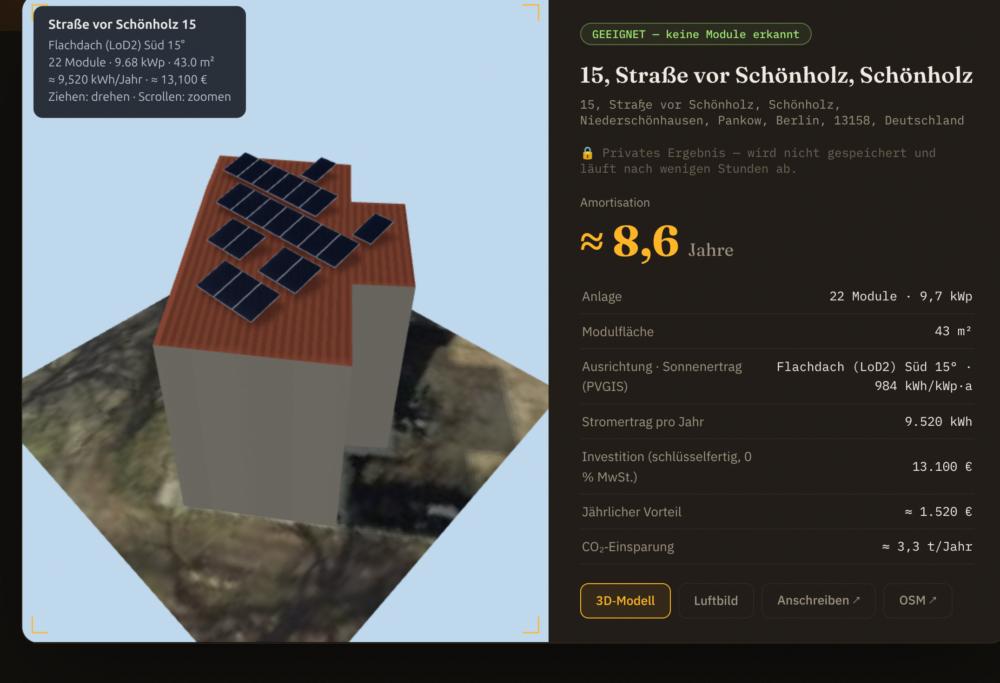

# ☀ solar·scout

**Find German roofs that are ready for solar, analyse them from official open
geodata, and turn each one into a costed, consent-based lead.** A concept
built end-to-end as a portfolio piece — a homeowner-facing roof check plus an
internal "demand cockpit" for a solar company's operations team.

<p align="center">
  <a href="https://solarscout.th3cyberworld.com">
    
  </a>
</p>

> Containerised and served via a Cloudflare Tunnel (rootless Docker, non-root
> container, capabilities dropped). The demo can be branded for any solar
> company through a single environment variable.



Type any German address → the app pulls the official aerial image, measures the
real 3D roof shape, detects whether panels already exist, plans a realistic
module layout, and estimates yield, cost, payback and CO₂ — in under a minute.

---

## What it does

**For the homeowner (public):**
1. **Address autocomplete** (Photon) for any address in Germany.
2. **Real-time roof analysis**: official orthophoto → building footprint →
   measured 3D roof → ML panel detection → layout → yield → economics.
3. A private, expiring result sheet with the aerial render, an **interactive
   three.js 3D model**, a printable offer letter (DE/EN), and the figures.

**For the solar company (internal "Demand-Cockpit"):**
- Funnel (roof checks → suitable roofs → consented quote requests), weekly
  activity, per-region demand comparison and conversion, B2B pipeline, and
  integration hooks (CRM export, "every installed roof is a Heartbeat
  candidate", expansion gap analysis).

## How it works — the data pipeline

| Stage | Source / method |
|---|---|
| Geocoding | Nominatim (resolve) + Photon (autocomplete) |
| Building footprint | OpenStreetMap via Overpass |
| Aerial imagery | Official state orthophoto WMS — **verified for all 16 German states** (10–40 cm, open data) |
| **Measured 3D roof** | State **CityGML LoD2** models (LiDAR): real pitch, azimuth, eaves/ridge heights. Wired up for BB, BE, NW, BY, NI; procedural fallback elsewhere |
| Existing-panel detection | YOLOv8 segmentation ([finloop/yolov8s-seg-solar-panels](https://huggingface.co/finloop/yolov8s-seg-solar-panels), MIT) with a classical-CV fallback |
| Sun exposure | **PVGIS** (EU JRC) — 18+ years of satellite irradiance for the exact coordinate, terrain-horizon shading |
| Economics | Size-tiered turnkey prices, 2026 EEG feed-in tariff, self-consumption, payback, CO₂ |

*Design choice: ML where it wins (image recognition), physics where it wins
(PVGIS for energy yield) — not ML for everything.*

## Engineering highlights

- **Obstruction-aware layout**: panels sit on the measured roof plane, avoid
  penthouses/dormers (from LoD2) and visible clutter (edge-density on the
  photo), and collapse to clean contiguous installer-style rows. Roofs with no
  usable area are reported honestly as *obstructed*, not force-fitted.
- **One geometry, every artifact**: the same 3D panel quads drive the aerial
  overlay, the 3D viewer, the letter and the CSV — they can't disagree.
- **Bilingual** (DE/EN) across UI and generated letters; German addresses stay
  German by design.
- **GDPR-aware**: results are private and ephemeral; a homeowner becomes a
  named lead only by explicit opt-in; everything else aggregates anonymously.
- **Honest estimates**: every figure is framed as a non-binding estimate
  (German case law treats unframed yield forecasts as warranted
  characteristics) with the engine's real error sources spelled out.

## Stack

Python · FastAPI · Vue 3 (CDN, no build step) · three.js · OpenCV · Shapely ·
PyProj · Ultralytics YOLO · SQLite · Docker · Cloudflare Tunnel.

## Run it locally

```bash
pip install -r requirements.txt

# one exact address, analysed in real time
python -m solar_scout --address "Str. vor Schönholz 14, 13158 Berlin"

# the web UI (homeowner + cockpit)
python -m solar_scout.webui          # http://127.0.0.1:8765
```

Or with Docker (production shape):

```bash
docker compose up -d --build
```

See [`docs/cli.md`](docs/cli.md) for the full CLI, [`docs/ARCHITECTURE.md`](docs/ARCHITECTURE.md)
for the detailed pipeline, and [`docs/DEPLOY.md`](docs/DEPLOY.md) for deployment.

## Honest limitations

This is a **screening tool and a concept**, not certified engineering. Roof
pitch is measured where LoD2 exists and assumed elsewhere; statics, electrics,
heritage rules and tree/neighbour shading are not assessed; the panel detector
is community-trained; prices and tariffs move. Real-world deviations of ±20 %
and more are possible — binding figures need an on-site survey. The lead
backend and pricing are demo-grade (SQLite, no auth on the cockpit, fair-use
public APIs).

---

Imagery © the German state surveying authorities (various open licences) ·
Footprints © OpenStreetMap contributors (ODbL) · Irradiance: PVGIS © European
Union · Detector model MIT (finloop). The demo brand name is configurable and
defaults to a generic placeholder; it is not affiliated with or endorsed by any
named company.
